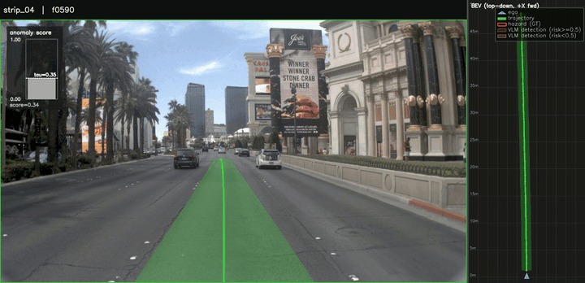

# Glance and Focus: Anomaly-Gated VLM Scoring for End-to-End Autonomous Driving



* Anomaly-Gated VLM scoring on a synthetic hazard scenario. 
* Please see demo.ipynb

## Assets


Download separately and place at the listed path:

| File | Path | Source |
|---|---|---|
| GTRS-Dense baseline checkpoint (902 MB) | `models/gtrs_dense_baseline.ckpt` | [Google Drive](https://drive.google.com/file/d/1pVNF0aASO1wM0xexMbPKXT8wDBWNQAmr/view?usp=drive_link) |
| Cosmos-Reason2 weights | HuggingFace cache `~/.cache/huggingface/cosmos-reason2-8b` | `nvidia/Cosmos-Reason2-8B` (HF) |

Quick fetch from the repo root:

```bash
mkdir -p models
wget --no-check-certificate \
     "https://drive.google.com/uc?export=download&confirm=t&id=1pVNF0aASO1wM0xexMbPKXT8wDBWNQAmr" \
     -O models/gtrs_dense_baseline.ckpt
```

If the download lands as an HTML "virus scan warning" page (large-file case),
fall back to `gdown`:

```bash
pip install gdown
gdown --id 1pVNF0aASO1wM0xexMbPKXT8wDBWNQAmr -O models/gtrs_dense_baseline.ckpt
```

NAVSIM dataset paths (set via env):
```bash
export OPENSCENE_DATA_ROOT=/path/to/navsim_data    # contains navsim_logs/, sensor_blobs/
export NAVSIM_EXP_ROOT=/path/to/exp_outputs
export NAVSIM_DEVKIT_ROOT=/abs/path/to/this/repo
export NUPLAN_MAPS_ROOT=/path/to/nuplan_maps       # required by NAVSIM
```

## Demo: Cascade vs always-on on normal scenes (sample500)

```bash
# Pre-requisites:
#   - 1) baseline GTRS-Dense predictions on the test split (e.g. navtest_sample1000.pkl).
#        Run with NAVSIM's run_pdm_score_one_stage_gpu.py (with SUBSCORE_PATH set).
#   - 2) Metric cache for the chosen split, e.g. cache/navtest_sample500_metric_cache.

# Stage 1 — VLM dump on every token in the predictions
PREDICTIONS_PATH=path/to/gtrs_dense_baseline.pkl \
VLM_OUT=exp/vlm_on_preds/vlm_risk.pkl \
python navsim/planning/script/run_vlm_dump_on_predictions.py \
    train_test_split=navtest_sample500 \
    experiment_name=vlm_dump \
    +cache_path=null

# Stage 2 — Anomaly gate (SigLIP2 kNN distance to reference bank)
python navsim/planning/script/run_anomaly_cascade_gate.py \
    --predictions    path/to/gtrs_dense_baseline.pkl \
    --vlm_risk       exp/vlm_on_preds/vlm_risk.pkl \
    --ref_embeds     exp/anomaly_poc/ref_embeds_diverse_fwd_strip.npy \
    --tau            0.15 \
    --out_vlm        exp/vlm_on_preds/vlm_risk_cascade_tau0.15.pkl \
    --out_scores     exp/vlm_on_preds/anomaly_scores.pkl

# Stage 3 — Rerank with R=5 m soft-buffer, H=1 m ego footprint, λ=8
python navsim/planning/script/rerank_predictions_with_vlm.py \
    --predictions    path/to/gtrs_dense_baseline.pkl \
    --vlm_risk       exp/vlm_on_preds/vlm_risk_cascade_tau0.15.pkl \
    --vocab          traj_final/8192.npy \
    --out            exp/vlm_on_preds/predictions_reranked_cascade.pkl \
    --mode mix --risk_threshold 0.5 --lambda_penalty 8 \
    --radius_m 5.0 --ego_half_width_m 1.0

# Stage 4 — PDMS on sample500 (auto-filters by metric cache intersection)
PREDICTIONS_PATH=exp/vlm_on_preds/predictions_reranked_cascade.pkl \
TRAIN_TEST_SPLIT=navtest_sample500 \
bash scripts/evaluation/score_from_predictions.sh
```

The `score_with_vlm.sh` wrapper chains stages 1+3+4 (always-on, no gate).
Cascade adds stage 2 between 1 and 3.

## Demo: Cascade vs always-on on hazard scenes (336 variants)

Uses the synthetic-hazard benchmark in `scripts/scenario_synth/`. Workflow
identical in spirit but works on the manifest-driven 14-scene × 24-variant
test set with collision rate as the metric.

```bash
# Always-on VLM dump on every (scene, variant, frame)
python scripts/scenario_synth/vlm_dump_benchmark.py --policy always_on

# Cascade-gate the dump (default τ=0.07, smoothing window=9)
python scripts/scenario_synth/derive_cascade.py --tau 0.07 --window 9

# Per-policy collision-rate analysis (baseline / always_on / cascade)
python scripts/scenario_synth/collision_analysis.py
```

## Citation / dependencies

- NAVSIM scoring core — [github.com/autonomousvision/navsim](https://github.com/autonomousvision/navsim)
- Cosmos-Reason2 — `nvidia/Cosmos-Reason2-8B` (HuggingFace)
- SigLIP2 — `google/siglip-base-patch16-224` (HuggingFace)
- GTRS-Dense — base trajectory scorer (provides 8192 vocab + per-vocab subscores)
